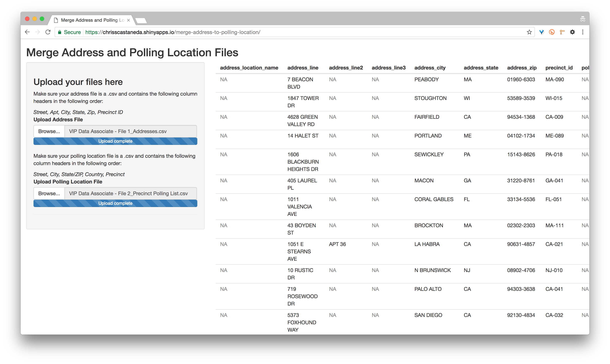

# Exercise in Programmatically Matching Address to Polling Places

Given a spreadsheet of addresses ([`VIP Data Associate - File 1_Addresses.csv`](https://github.com/chrisscastaneda/merge-address-to-polling-location/blob/master/data/VIP%20Data%20Associate%20-%20File%201_Addresses.csv)) and a spreadsheet of associated polling paces ([`VIP Data Associate - File 2_Precinct Polling List.csv`](https://github.com/chrisscastaneda/merge-address-to-polling-location/blob/master/data/VIP%20Data%20Associate%20-%20File%202_Precinct%20Polling%20List.csv)), this is how one could merge two files along a common attribute, in this case along the Precinct ID values in each file.  While it's certainly possible to manually clean and merge two spreadsheets in Excel, in order to accomplish the task efficiently at scale it is important to approach the task programmatically.  

### The following files are included in my project:

- [`merge.R`](https://github.com/chrisscastaneda/merge-address-to-polling-location/blob/master/merge.R): This is the primary file that contains my solution and ultimately generates the requested files listed below. 
- [`commonStreetAddressSuffixes.R`](https://github.com/chrisscastaneda/merge-address-to-polling-location/blob/master/commonStreetAddressSuffixes.R): Helper file sourced by `merge.R`.  Encapsulates a large regex pattern for identifying street address suffixes.
- [`app.R`](https://github.com/chrisscastaneda/merge-address-to-polling-location/blob/master/app.R): Shiny webapp that allows user to upload an address file and a polling list file, then cleans and merges them.  You can checkout the live Shiny app here: [chrisscastaneda.shinyapps.io/merge-address-to-polling-location/](https://chrisscastaneda.shinyapps.io/merge-address-to-polling-location/).

### Here are the requested files:

This is the cleaned and merged data file:

  - [`VIP_Data_Associate_Merged_Address_Polling.csv`](https://github.com/chrisscastaneda/merge-address-to-polling-location/blob/master/VIP_Data_Associate_Merged_Address_Polling.csv)

These are the requested VIP 3.0 formated files:

  - [`precinct.txt`](https://github.com/chrisscastaneda/merge-address-to-polling-location/blob/master/precinct.txt)
  - [`polling_locations.txt`](https://github.com/chrisscastaneda/merge-address-to-polling-location/blob/master/polling_locations.txt)
  - [`precinct_polling_locations.txt`](https://github.com/chrisscastaneda/merge-address-to-polling-location/blob/master/precinct_polling_locations.txt)


## Step-by-step Overview:

I decided to solve this problem using R, however a similar platform, such as Python, could easily be used instead.  While my response is written in R I'll explain my basic approach in a manner that is language agnostic. 

The first step is to check for any common data entry errors, correct for messy data, and otherwise deal with any holes that may be in the data.  One of the most common types of "messy" data is data that is misaligned, that is the data in one row may not be lined up properly with the overall schema of the spreadsheet or table.  

For example, a misaligned row could look like this: 

|Street|City|State Zip|Country|Precinct|
|------|----|---------|-------|--------|
|974 Great Plain Avenue Needham MA 02492|USA|MAS-006| | |

We want it to look like this:

|Street|City|State Zip|Country|Precinct|
|------|----|---------|-------|--------|
|974 Great Plain Avenue|Needham|MA 02492|USA|MAS-006|

A good rule of thumb for identifying the rows in the data that may be misaligned is looking for missing values in the last/right-most column in the data.  In our case, this is the Precinct ID column in each of our spreadsheets.  This has the added benefit of being a mandatory column for each of our spreadsheets and the column we're ultimately going to merge them by, so we definitely want to make sure there are no holes here.

Once we've identified the rows that are potentially misaligned, we now must figure out how to realign them to the proper schema.  The approach I took was to concatenate each row into a string, then parse that string using regex pattern matching to identify key parts in the address.  It was also helpful to split the concatenated string up into an array of words, i.e. split the string at each space.

So our example address as just a string looks like this:

```
"974 Great Plain Avenue Needham MA 02492 USA MAS-006"
```

And if we convert that into an array of words, we get something that looks like this:

```
[974][Great][Plain][Avenue][Needham][MA][02492][USA][MAS-006]
```

Once we can identify key substrings in the addresses we can begin to properly atomize the address strings into their component parts.  First I located the zipcode in each string using the following regex pattern: `[0-9]{5}([- ][0-9]{4})?`.  Once we know where the zipcode is in the address string, we can inch over and identify the state substring next to the zipcode.  Next I located the end of the street address substring by looking for street address suffixes (i.e. Ave., Road, Ln., St. Blvd, etc).  The regex for street address suffixes looks a little like this: `\b(?:AVE|BLVD|LN|RD|ROAD|etc|etc)\b`.  In actuality I refereed to USPS's website and found a list of over 900 common street address suffixes, you can see how I actually constructed that regex pattern in the file [`commonStreetAddressSuffixes.R`](https://github.com/chrisscastaneda/merge-address-to-polling-location/blob/master/commonStreetAddressSuffixes.R).  From there, you have enough information to fully parse the address.  

The next major step is to normalize the Precinct ID values in each data file.  To do this I took the existing precinct ID values and split each of those strings by the dash in each string to separate the ID prefixes from the ID suffixes.  I replaced the prefixes with the standard two letter state abbreviation and ensured each suffix was three digits long (i.e. I made sure that leading zeros were added to any suffix values that were less than thee digits).

Once the Precinct IDs in each spreadsheet are standardized, it's then relatively straight forward to merge or join the two tables together along the common attribute. Specifically, in this case, we want to do a **left inner join** on the data tables.

Once you have the basic clean up and merge algorithm worked out, it then becomes important to operationalize your solution.  Creating a simple web app is one way to do this.  


[chrisscastaneda.shinyapps.io/merge-address-to-polling-location/](https://chrisscastaneda.shinyapps.io/merge-address-to-polling-location/)

For the purpose of this exercise, I created a necessarily trivial web app using the [Shiny web application framework](http://shiny.rstudio.com/).  The web app is more a proof of concept rather than something production ready, but is an example of how one could easily take method describe above and apply it on a much larger scale.


